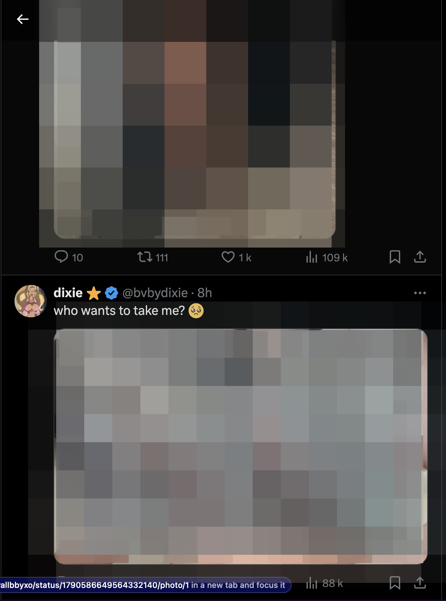
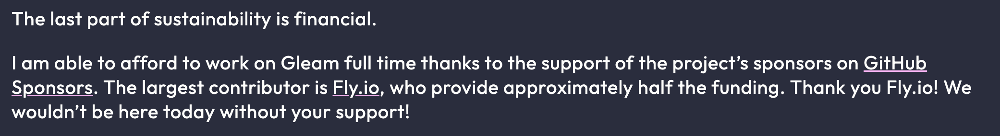
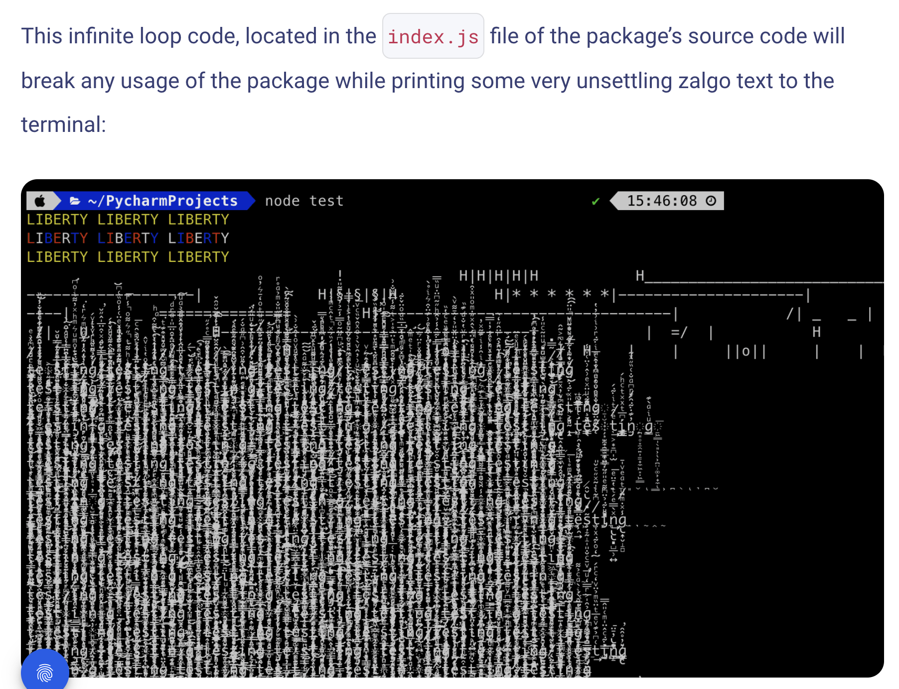
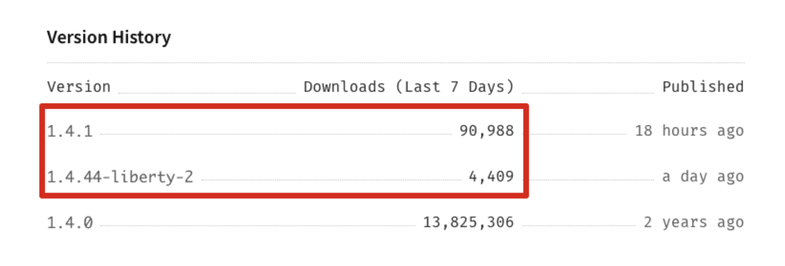

# ethan - b2-open-source

## 1. Licences

- a) Quelle licence serait appropriée si je veux une licence permissive ?

> La licence la plus appropriée pour une licence "permissive" serait la licence "MIT", mais on peut aussi en utiliser d'autres, les licences "BSD", la licence "Apple Public Source" et la licence "Apache".

(Source: [wikipedia](https://fr.wikipedia.org/wiki/Licence_de_logiciel_permissive))

- b) Quelle licence serait appropriée si je veux que les projets utilisant ma solution soient obligatoirement open source eux aussi ?

> Il faudrait une licence copyleft qui rend persistant les libertés d'accès au code source.

(Source : [wikipedia](https://fr.wikipedia.org/wiki/Copyleft#), [guide open source chepa quoi](http://www.guideopensource.info/guide/choisir-licence-open-source-adaptee-besoin#booknode-72))

- c) Quelles sont mes obligations si j'utilise un projet sous licence `Creative Commons Attribution 4.0 International` ?

> Si j'utilise cette licence, on a le droit de copier et partager la solution de la façon que l'on veut dans n'importe quel format (même commercial), d'adapter la solution de la façon que l'on veut dans n'importe quel format aussi (même commercial encore lol) cependant il faut bien donner le crédit à l'auteur principal ! Donc je dirais la GNU General public licence.

(Source : [wikipedia encore lol](https://creativecommons.org/licenses/by/4.0/deed.en))

- d) Qu'appelle-t-on une licence "contagieuse" ?

> Comme son nom l'indique, une licence contagieuse stipule que tout programme dérivé d'un programme disposant d'une licence contagieuse doit hériter de cette licence.

(Source : [chatgpt lol g tenté]("https://chatgpt.com/c/2319edcd-cbca-496f-a9e5-466acd8e9756"))

## 2. Solutions propriétaires vs open source

### Bruno vs Postman

- a) Quelles raisons ont poussé beaucoup d'utilisateurs à chercher une alternative à Postman ?

> Les features sur Postman deviennent plus compliqué à utiliser à l'instar d'outil comme Insomnia par exemple. Il y a aussi énormément d'alternatives plus simple et plus rapide. Il y a aussi un CLOUD payant pour Postman, ce qui est un peu controversé pour un outil simplement censé faire des requetes quoi... Les requêtes passent aussi par un serveur proxy PROPRIÉTAIRE ce qui casse un peu l'idée du logiciel libre open source fin bref on controle pas vraiment nos données du coup. Pour ma part, je n'utilise plus Postman car je commence à le trouver trop chiant avec des features en plus que je trouve useless et il faut être en ligne pour l'utiliser ! Ça me rappelle un peu Diablo 4, un jeu ou t'es tout seul mais tu dois être connecté alors que bah tu veux juste chill solo.

(Source: [moi du coup mdr (le lien de mon portfolio oeoe mgl)](https://ethan-folio.fr), [le mec là](https://www.youtube.com/watch?v=VX8cK30ucOE), [testfully](https://testfully.io/blog/top-5-postman-alternatives/))

- b) Quels sont les avantages de Bruno ?

> Bruno utilise un systeme de collection qui est stocké dans des fichiers locaux dans un dossier que l'on peut versionné, cela donne déja plus de liberté sur le versionning (là ou Postman a un versionning payant, son cloud là). Bruno fait direct la requetes depuis ton pc pour aller là où elle doit aller quoi, Postman nécessite d'être online et fait passer la requête par un proxy de m****. Y a aussi un système collections payants sur postman alors que pas sur Bruno et une gestion de dépendance node sur Bruno qui est plus simple que sur Postman bref ! Pour avoir encore plus de détails, je suis aller sur le site "usebruno machin là" donc ne pas hésiter à voir ma cesour !

(Source : [usebruno machin là](https://www.usebruno.com/compare/bruno-vs-postman))
### Twitter vs Mastodon

- c) À votre avis, quelles raisons ont poussé beaucoup d'utilisateurs à chercher une alternative à Twitter (ou X) ?

> Depuis le rachat par monsieur Musk, plusieurs choses ont dégoutés les utilisateurs de twitter, déja on a le paiement pour la certification, qui donc n'est plus une certification ? car normalement elle servait à voir quel compte était "les vrais" (ça servait surtout à flex lol) donc là si on peut payer pour l'avoir ça sert à rien. Les contenus qui se diffusent le plus sont les plus mis en avant (ce qui est vrai, utilisant la plateforme depuis longtemps on voit vraiment un changement). Le contenu pornographique qui est de plus en plus sur la plateforme, j'ai vraiment passé 30 secondes sur la plateforme pour trouver ça dans mon fil :  je floute et pixellise quand même mais c'est vraiment une dinguerie je trouve et ça se fait pas ban, je suis là pour me pougner ouuuu ET C'EST CERTIFIÉ EN PLUS GENRE ? La multiplication de fausses e girl aussi, pleins de comptes fakes qui se font passer pour des meufs pour attirer des vieux et leur soutirer de l'argent contre des fausses photos trouvés sur des forums de gros puants (j'ai un avis très tranché sur ce sujet). D'ailleurs on voit un changement dans le courbe des stars de Mastodon au moment du rachat de Twitter par Monsieur Musk !

(source : moi encore en vrai et mon experience de pro twittos, [france info mdr](https://www.francetvinfo.fr/internet/reseaux-sociaux/twitter/video-qu-est-ce-qui-a-change-sur-twitter-x-depuis-le-rachat-par-elon-musk_6215136.html), [mastodon machin](https://star-history.com/#mastodon/mastodon&Date))

### Animejs, GSAP & rémunération

- d) Quelles sont les différences entre Animejs et GSAP, 2 librairies utilisées pour faire des animations web ?
> AnimeJS est plus simple d'utilisation et plutot léger pendant que GSAP est plus compliqué à utiliser mais plus rapide ! Il y a aussi des licences différentes, AnimeJS est sous MIT License (donc commercial ok), alors que GSAP a une licence greensock de la mort qui autorise l'utilisation commercial si le client ne paie qu'UNE seule fois, mais si y a un frais d'utilisations par mois ça va pas appremment.

(source : [slant](https://www.slant.co/versus/13217/17517/~gsap_vs_anime-js), [gsap licence jcrois](https://gsap.com/community/standard-license/))

- e) Pourquoi GSAP a choisi une licence moins permissive ?

> GSAP a choisi cette licence car ils ont besoin de rémunéré les développeurs qui travaillent dessus tout simplement (les maintainers 😎) Et étant donné que GSAP n'est pas un projet open source classique et qu'il demande beaucoup de forces car énormément d'animations (et les animations peuvent bugger en fonction) donc ils ont choisé cette licence là pour ça là ou Anime JS n'a pas les mêmes prétentions que GSAP (le dernier commit date d'il y a 2 mois par exemple et c bon quoi c'est trkl) ! (ce qui est compréhensible en vrai)

(source : [why licence gsap](https://gsap.com/blog/why-license), [anime machin](https://github.com/juliangarnier/anime/))

- f) Comment les projets open source peuvent être rémunérés et donc maintenus correctement ?

> La plupart des projets open source peuvent être maintenu de plusieurs manières : Les sponsors, les gens donnent des sous par mois (comme on peut le voir par exemple dans les commentaires de la v1 de gleam 😎)  Sinon il peut aussi y avoir des frais d'utilisation du logiciels, par exemple sur strapi ou pour avoir certaines parties du logiciels, il faut payer !

(source : [le pricing gsap](https://gsap.com/pricing/), [celui de strapi ossi](https://strapi.io/pricing-cloud))

### Le cas de Meta

- g) Qu'est-ce qui a poussé Meta à changer la licence de React ?

> Grâce à ce changement de licence, Meta empêche les utilisateurs de son logiciel de le poursuivre en justive s'il souhaite détenir un brevet qui empiete sur son travail, c'est un peu fourbe. Mais ce qui les a poussé à faire ça serait car ils recoivent beaucoup de demandes de brevets à leur encontres (sans fondements apparemment) qui leur coute beaucoup de temps et de travail ILS ONT DONC DECIDE DE METTRE UN "CHEVAL DE TROIE" (c'est les mot utilisé ca me fume) pour dissuader les gens de le faire ... Et ils disent que toutes les autres entreprises devraient faire pareil et beh pas mal ça.

(source : [l'article medium](https://medium.com/@raulk/if-youre-a-startup-you-should-not-use-react-reflecting-on-the-bsd-patents-license-b049d4a67dd2))

## 3. Quand ça tourne mal

### colors & faker.js

- a) Résumer brièvement ce qui s'est passé sur ces 2 packages

> L'histoire assez "étrange" des auteurs qui ont corrompus leur propre package, en gros un mec qui tenait les packages a décidé de faire une petite release un peu salé car il gagnait pas bcp de sous avec l'open source, frustration compréhensible, solution un peu lourde quand tu sais que la paquet était quand même pas mal utilisé. pour finalement faire planté les programmes avec ça :

(source : [revenera marcus lucero](https://www.revenera.com/blog/software-composition-analysis/the-story-behind-colors-js-and-faker-js/), ["snyk"](https://snyk.io/blog/open-source-npm-packages-colors-faker/))
- b) En quoi était-ce une faille importante ?

> La faille était importante car le paquet était beaucoup utilisé et personne a vraiment fait gaffe car c'est un paquet avec une fonctionnalité assez "simple", genre c'est pas censé crash 

(source : [revenera marcus lucero](https://www.revenera.com/blog/software-composition-analysis/the-story-behind-colors-js-and-faker-js/))
- c) Quelles sont les solutions pour se prémunir de ce genre de faille ?

> Vérifier lorsqu'on met à jour ses dépendances et pas faire confiance direct au github bot en vrai, parce que si ces versions avaient été testés avant d'être mise en prod on aurait jamais eu ce soucis

### XZ backdoor

- d) À votre avis, quels sont les avantages d'avoir une faille dans une solution open source plutôt que propriétaire ?

> Dans le cas de XZ, avoir un repo public permet plusieurs choses : de fermer le repo au public le temps d'une solution, identifier l'auteur et voir si il a travaillé sur d'autres projets où il aurait pu incorporer une faille, et dans ce genre de cas, les utilisateurs peuvent avoir un feedback direct sur ce qui se passe.

---

LICENSE: CC-BY-SA-4.0
